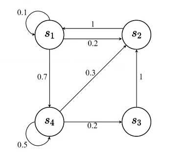
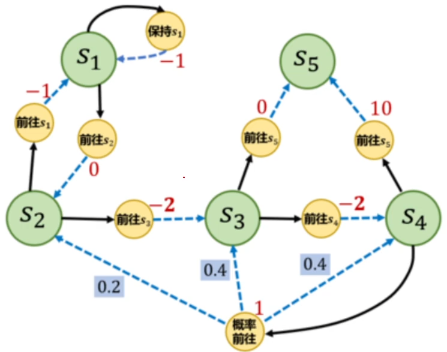
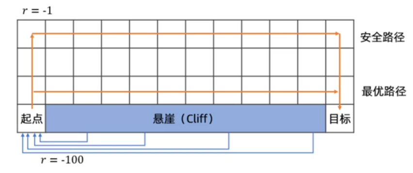
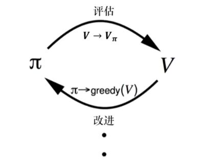

## 马尔可夫过程
在随机过程中，**马尔可夫性质**（Markov property）指的是一个随机过程在给定现在状态及过去所有状态的情况下，其**未来状态的条件概率分布仅依赖于当前状态**。

> 未来的转移与过去是独立的，它只取决于现在

马尔可夫过程是一组具有马尔可夫性质的随机变量序列 $$ s_1,...,s_t $$ ，其中下一个时刻的状态 $$ s_{t+1} $$ 只取决于当前状态 $$ s_t $$ 。假设历史状态为 $$ h_t=\{s_1,s_2,...,s_t\} $$ ，则马尔可夫过程满足条件：

$$
    \begin{equation}
        p(s_{t+1}|s_t)=p(s_{t+1}|h_t)
    \end{equation}
$$



马尔可夫过程的状态转移矩阵（state transition matrix）：

$$
    P=
    \begin{pmatrix}
    p(s_1|s_1) & p(s_2|s_1) & \cdots & p(s_N|s_1)\\
    p(s_1|s_2) & p(s_2|s_2) & \cdots & p(s_N|s_2)\\
    \vdots & \vdots & \ddots & \vdots \\
    p(s_1|s_N) & p(s_2|s_N) & \cdots & p(s_N|s_N)
    \end{pmatrix}
$$

可知 $$ p(s_1|s_1)+p(s_2|s_1)+...+p(s_N|s_1)=1 $$ ，即从 $$ s_1 $$ 转移至所有状态（包括它自己）的概率总和为1。但是，任意状态转移至 $$ s_1 $$ 的概率总和，即 $$ p(s_1|s_1)+p(s_1|s_2)+...+p(s_1|s_N) $$ ，不一定为1。

## 马尔可夫奖励过程
马尔可夫奖励过程（Markov reward process，MRP）是**马尔可夫链加上奖励函数**，当达到某一状态的时候，可以获得多大的奖励。

### 相关概念

+ **范围**（horizon）：一个回合的长度（每个回合最大的时间步数）；
+ **回报**（return）：奖励的逐步叠加；

### 折扣回报
假设时刻 $$ t $$ 后的奖励序列为 $$ r_{t+1},r_{t+2},...,r_{r_T} $$ ，则折扣回报（discounted return）为：
$$
\begin{equation}
    G_t=r_{t+1}+\gamma r_{t+2}+\gamma^2r_{t+3}+\gamma^3r_{t+4}+...+\gamma^{T-t-1}r_T
\end{equation}
$$
其中， $$ T $$ 为最终时刻， $$ \gamma $$ 为折扣因子，越往后得到奖励的折扣越多，因此更倾向于得到现在的奖励，而不是未来的奖励。

### 状态价值函数
状态价值函数（state-value function）即为回报的期望：
$$
\begin{align}
V^t(s)&=\Bbb E[G_t|s_t=s]\\
&=\Bbb E[r_{t+1}+\gamma r_{t+2}+\gamma^2r_{t+3}+...+\gamma^{T-t-1}r_T|s_t=s]
\end{align}
$$
其中， $$ G_t $$ 为折扣回报，对 $$ G_t $$ 取的期望表示从这个状态开始，可能获得多大的价值。

### 贝尔曼方程
贝尔曼方程（也即“动态规划方程”）是**当前状态与未来状态的迭代关系**，表示当前状态的价值函数可以通过下一个状态的价值函数来计算。其定义了状态之间的迭代关系，即：
$$
    \begin{equation}
        V(s)=R(s)+\gamma\sum_{s^{\prime}\in S}p(s^{\prime}|s)V(s^{\prime})
    \end{equation}
$$
其中 $$ R(s) $$ 表示即时奖励， $$ \gamma\sum_{s^{\prime}\in S}p(s^{\prime}|s)V(s^{\prime}) $$ 表示未来奖励的折扣总和，其中， $$ s^{\prime} $$ 可以看成未来的所有状态； $$ p(s^{\prime}|s) $$ 为从当前状态转移到未来某个状态的概率， $$ V(s^{\prime}) $$ 代表未来某一个状态的价值，两者相乘求和代表未来奖励的总和，再乘上 $$ \gamma $$ 计算未来奖励折扣后的总和。

> **推导**
> $$
    \begin{align}
    V(s)&=\Bbb E[G_t|s_t=s]\\
    &=\Bbb E[r_{t+1}+\gamma r_{t+2}+...+\gamma^{T-t-1}r_T|s_t=s]\\
    &=\Bbb E[r_{t+1}|s_t=s]+\gamma\Bbb E[r_{t+2}+\gamma r_{t+3}+...+\gamma^{T-t-2}r_T|s_t=s]\\
    &=R(s)+\gamma\Bbb E[G_{t+1}|s_t=s]\\
    &=R(s)+\gamma \sum_{s^{\prime}\in S}p(s^{\prime}|s)V(s^{\prime})
    \end{align}
> $$

### 计算马尔可夫奖励过程价值
将**迭代**的方法应用于状态非常多的马尔科夫奖励过程：动态规划方法、蒙特卡洛方法（通过采样的方法计算）、时序差分学习。蒙特卡洛方法计算价值：从某个状态开始，让其在状态转移矩阵中“随波逐流”，产生一个轨迹，将得到的折扣回报 $$ g $$ 累积起来，获得回报 $$ G_t $$ ，当积累了一定数量的轨迹之后，用 $$ G_t $$ 除以轨迹数量，就会得到该状态的价值。

>**蒙特卡洛方法计算价值过程**
>
>+  \$$ i\larr0,G_t\larr0 $$ 
>+ 当 \$$ i\neq N $$ 时，执行：
>  + 生成一个回合的轨迹，从状态 \$$ s $$ 和时刻 \$$ t $$ 开始
>  + 使用生成的轨迹计算回报 \$$ g=\sum_{i=t}^{H-1}\gamma^{i-t}r_i $$ 
>  +  \$$ G_t\larr G_t+g,i\larr i+1 $$ 
>+ 结束循环
>+  \$$ V_t(s)\larr G_t/N $$ 

## 马尔可夫决策过程
马尔可夫决策过程比奖励过程多了**决策**，状态转移也多了一个动作的条件，即： $$ p(s_{t+1}=s^{\prime}|s_t=s,a_t=a) $$ 。此时，未来的状态不仅依赖于**当前的状态**，也依赖于**当前智能体采取的动作**。马尔可夫决策过程满足：
$$
    \begin{equation}
        p(s_{t+1}|s_t,a_t)=p(s_{t+1}|h_t,a_t)
    \end{equation}
$$
同理，奖励函数也多加一个动作条件，当前状态和采取的动作会决定智能体当前可能得到的奖励，即： $$ R(s_t=s,a_t=a)=\Bbb E(r_t|s_t=s,a_t=a) $$ 。

在知道当前的状态后，策略定义了在某一个状态应该采取的行动，将当前状态带入到策略函数中，可以得到一个概率，这个概率就代表了在**所有可能的动作里怎样采取行动**，即：
$$
    \begin{equation}
        \pi(a|s)=p(a_t=a|s_t=s)
    \end{equation}
$$
已知了马尔可夫决策过程以及策略 $$ \pi $$ ，就可以将马尔可夫决策过程转换成马尔科夫奖励过程，在已知了每一种状态下，可能采取的动作的概率，就可以去掉 $$ a $$ ，得到对于马尔科夫奖励过程的转移：
$$
    \begin{equation}
        P_\pi(s^{\prime}|s)=\sum_{a\in A}\pi(a|s)p(s^{\prime}|s,a)
    \end{equation}
$$
同理，也可以得到去掉动作的马尔可夫过程的奖励函数和价值函数：
$$
    \begin{align}
        r_\pi (s)=\sum_{a\in A}\pi(a|s)R(s,a)\\
        V_{\pi}(s)=\Bbb E_{\pi}[G_t|s_t=s]
    \end{align}
$$
此时可以引入一个动作价值函数Q（action-value function），Q函数的定义为**在某一个状态采取某一个动作，它有可能得到的回报的一个期望**，表示为 $$ Q_{\pi}(s,a)=\Bbb E_{\pi}[G_t|s_t=s,a_t=a] $$ 。又因为这里的期望是基于策略函数的，所以可以对策略函数和动作价值函数Q相乘后加和，就可以得到基于该策略的状态价值函数：
$$
    \begin{equation}
        V_{\pi}(s)=\sum_{a\in A}\pi(a|s)Q_{\pi}(s,a)
    \end{equation}
$$

## 马尔可夫过程实现
### 马尔可夫奖励过程

有6个状态的马尔科夫图，它的状态转移矩阵：

$$
    P=
    \begin{bmatrix}
    0.9&0.1&0&0&0&0\\
    0.5&0&0.5&0&0&0\\
    0&0&0&0.6&0&0.4\\
    0&0&0&0&0.3&0.7\\
    0&0.2&0.3&0.5&0&0\\
    0&0&0&0&0&1
    \end{bmatrix}
$$

代码表示：

```python
np.random.seed(0)
P = [
    [0.9, 0.1, 0.0, 0.0, 0.0, 0.0],
    [0.5, 0.0, 0.5, 0.0, 0.0, 0.0],
    [0.0, 0.0, 0.0, 0.6, 0.0, 0.4],
    [0.0, 0.0, 0.0, 0.0, 0.3, 0.7],
    [0.0, 0.2, 0.3, 0.5, 0.0, 0.0],
    [0.0, 0.0, 0.0, 0.0, 0.0, 1.0]
]
P = np.array(P)
rewards = [-1, -2, -2, 10, 1, 0]  # 奖励函数
gamma = 0.5  # 折扣因子
```

计算某条序列的折扣回报总和G：

```python
def compute_return(start_idx, chain, gamma):
    G = 0
    for i in reversed(range(start_idx, len(chain))):
        G = gamma * G + rewards[chain[i] - 1]
    return G

# s1-s2-s3-s6
chain = [1, 2, 3, 6]
start = 0
G = compute_return(start, chain, gamma)
print(G)
```

```
-2.5
```

利用贝尔曼方程矩阵形式计算每个状态价值:

```python
def Bellman(P, rewards, gamma, states_num):
    rewards = np.array(rewards).reshape((-1, 1))  # 转换成列向量
    value = np.dot(np.linalg.inv(np.eye(states_num, states_num) - gamma * P), rewards)
    return value

V = Bellman(P, rewards, gamma, 6)
print("MPR中每个状态价值为\n", V)
```

```
MPR中每个状态价值为
 [[-2.01950168]
 [-2.21451846]
 [ 1.16142785]
 [10.53809283]
 [ 3.58728554]
 [ 0.        ]]
```

### 马尔可夫决策过程



代码表示：

```python
S = ["s1", "s2", "s3", "s4", "s5"]  # 状态集合
A = ["保持s1", "前往s1", "前往s2", "前往s3", "前往s4", "前往s5", "概率前往"]  # 动作集合
# 状态转移函数
P = {
    "s1-保持s1-s1": 1.0, "s1-前往s2-s2": 1.0,
    "s2-前往s1-s1": 1.0, "s2-前往s3-s3": 1.0,
    "s3-前往s4-s4": 1.0, "s3-前往s5-s5": 1.0,
    "s4-前往s5-s5": 1.0, "s4-概率前往-s2": 0.2,
    "s4-概率前往-s3": 0.4, "s4-概率前往-s4": 0.4,
}
# 奖励函数
R = {
    "s1-保持s1": -1, "s1-前往s2": 0,
    "s2-前往s1": -1, "s2-前往s3": -2,
    "s3-前往s4": -2, "s3-前往s5": 0,
    "s4-前往s5": 10, "s4-概率前往": 1,
}
gamma = 0.5  # 折扣因子
MDP = (S, A, P, R, gamma)

# 策略1,随机策略
Pi_1 = {
    "s1-保持s1": 0.5, "s1-前往s2": 0.5,
    "s2-前往s1": 0.5, "s2-前往s3": 0.5,
    "s3-前往s4": 0.5, "s3-前往s5": 0.5,
    "s4-前往s5": 0.5, "s4-概率前往": 0.5,
}
# 策略2
Pi_2 = {
    "s1-保持s1": 0.6, "s1-前往s2": 0.4,
    "s2-前往s1": 0.3, "s2-前往s3": 0.7,
    "s3-前往s4": 0.5, "s3-前往s5": 0.5,
    "s4-前往s5": 0.1, "s4-概率前往": 0.9,
}


# 把输入的两个字符串通过“-”连接,便于使用上述定义的P、R变量
def join(str1, str2):
    return str1 + '-' + str2
```

利用蒙特卡洛方法采样序列：

```python
# 采样函数，限制最长时间步timestep_max,总共采样序列数number
def Sampling(MDP, Pi, timestep_max, num):
    S, A, P, R, gamma = MDP
    episodes = []  # 采样序列集合
    for _ in range(num):
        episode = []  # 采样序列
        timestep = 0
        s = S[np.random.randint(4)]  # 随机选择一个除s5以外的状态s作为起点
        # s5为终点，当走到s5时，一次采样结束
        while s != "s5" and timestep <= timestep_max:
            timestep += 1
            rand, temp = np.random.rand(), 0
            # 在状态s下根据策略选择动作
            for a_opt in A:
                temp += Pi.get(join(s, a_opt), 0)
                if temp > rand:
                    a = a_opt
                    r = R.get(join(s, a), 0)
                    break
            rand, temp = np.random.rand(), 0
            # 动作完成后根据转移概率得到下一个状态s_next
            for s_opt in S:
                temp += P.get(join(join(s, a), s_opt), 0)
                if temp > rand:
                    s_next = s_opt
                    break
            episode.append((s, a, r, s_next))
            s = s_next  # 又把s_next变成当前状态，继续前往下一个状态
        episodes.append(episode)
    return episodes

episodes = Sampling(MDP, Pi_1, 20, 5)
print('第一条序列\n', episodes[0])
print('第二条序列\n', episodes[1])
print('第三条序列\n', episodes[2])
print('第四条序列\n', episodes[3])
print('第五条序列\n', episodes[4])
```

```
第一条序列
 [('s1', '前往s2', 0, 's2'), ('s2', '前往s3', -2, 's3'), ('s3', '前往s5', 0, 's5')]
第二条序列
 [('s4', '概率前往', 1, 's4'), ('s4', '前往s5', 10, 's5')]
第三条序列
 [('s4', '前往s5', 10, 's5')]
第四条序列
 [('s2', '前往s1', -1, 's1'), ('s1', '保持s1', -1, 's1'), ('s1', '前往s2', 0, 's2'), ('s2', '前往s3', -2, 's3'), ('s3', '前往s4', -2, 's4'), ('s4', '前往s5', 10, 's5')]
第五条序列
 [('s2', '前往s3', -2, 's3'), ('s3', '前往s4', -2, 's4'), ('s4', '前往s5', 10, 's5')]
```

```python
# 对所有采样序列计算所有状态的价值
def MonteCarlo(episodes, V, N, gamma):
    for episode in episodes:
        G = 0
        for i in range(len(episode) - 1, -1, -1):  #一个序列从后往前计算
            (s, a, r, s_next) = episode[i]
            G = r + gamma * G  # 计算折扣回报
            N[s] = N[s] + 1  # 计数器加1
            V[s] = V[s] + (G - V[s]) / N[s]  # 更新价值

timestep_max = 20
episodes = Sampling(MDP, Pi_1, timestep_max, 1000)  # 采样1000次，采用随机策略Pi_1
gamma = 0.5
V = {"s1": 0, "s2": 0, "s3": 0, "s4": 0, "s5": 0}
N = {"s1": 0, "s2": 0, "s3": 0, "s4": 0, "s5": 0}
MonteCarlo(episodes, V, N, gamma)
print("使用蒙特卡洛方法计算MDP的状态价值为\n", V)
```

```
使用蒙特卡洛方法计算MDP的状态价值为
 {'s1': -1.2250047295780488, 's2': -1.6935084269467038, 's3': 0.48519918492538405, 's4': 5.97601313133763, 's5': 0}
```

## 悬崖漫步问题
>悬崖漫步（Cliff Walking）是一个非常经典的强化学习环境，它要求一个智能体从起点出发，避开悬崖行走，最终到达目标位置。如图所示，有一个 4x12 的网格世界，每一个网格表示一个状态。智能体的起点是左下角的状态，目标是右下角的状态，智能体在每一个状态都可以采取4种动作：**上、下、左、右**。
>
>如果智能体采取动作后触碰到边界墙壁则状态不发生改变，否则就会相应到达下一个状态。环境中有一段悬崖，智能体掉入悬崖或到达目标状态都会结束动作并回到起点，也就是说**掉入悬崖或者达到目标状态是终止状态**。智能体每走一步的奖励是 -1，掉入悬崖的奖励是 -100。
>
>

### 寻找最优策略

策略评估指的是给定马尔可夫决策过程和策略，可以估算出价值函数的值。现在的问题是如何找到最佳的策略，从而得到最佳价值函数（optimal value function）： $$ V^*(s) = \max_{\pi}V_{\pi}(s) $$ 。

最佳策略 $$ \pi $$ 使得每个状态的价值函数都取得最大值，当价值函数在策略下最大化的情况下，该策略就是最佳策略，即：
$$
    \begin{equation}
        \pi^*(s)={\arg \max}_{\pi}V_{\pi}(s)
    \end{equation}
$$
当取得最佳价值函数后，因为Q函数是关于状态和动作的函数，所以如果在某个状态采取某个动作使得Q函数最大化，那么这个动作就是**最佳动作**。因此可以通过**对Q函数进行最大化**来得到最佳策略：
$$
    \pi^*(a|s)=
    \begin{cases}
    1,&a={\arg \max}_{a \in A}Q^*(s, a)\\
    0,&其它
    \end{cases}
$$

+ **策略迭代**

  策略迭代由**策略评估**和**策略改进**组成。先给定当前的策略函数来估计状态价值函数，得到状态价值函数后，通过奖励函数以及状态转移函数进一步推算出Q函数，即：
  $$
    \begin{equation}
        Q_{\pi_i}(s,a)=R(s,a)+\gamma\sum_{s^{\prime}\in S}p(s^{\prime}|s,a)V_{\pi_i}(s^{\prime})
    \end{equation}
  $$
  最大化Q函数，通过在Q函数做一个贪心搜索来进一步改进策略，过程如图：

  

+ **价值迭代**

  第一步执行最优的动作，之后后继的状态的每一步都按照最优的策略去做，最后的结果就是最优的。为了得到最佳的 $$ V^* $$ ，通过贝尔曼最优方程进行迭代，迭代多次后价值函数就会收敛，也即**确认性价值收敛**，如下：

  + 初始化：令 \$$ k=1 $$ ，对于所有状态 \$$ s $$ ， \$$ V_0(s)=0 $$ 

  +  \$$ for\space k=1:H $$ （ \$$ H $$ 是让 \$$ V(s) $$ 收敛所需的迭代次数）

    + 对于所有状态 \$$ s $$ 

       \$$ Q_{k+1}(s,a)=R(s,a)+\gamma\sum_{s^{\prime}\in S}p(s^{\prime}|s,a)V_{\pi_i}(s^{\prime}) $$ 

       \$$ V_{k+1}(s)=\max_aQ_{k+1}(s,a) $$ 

    +  \$$ k\larr k+1 $$ 

  + 在迭代后提取最优策略

     \$$ \pi(s)={\arg\max}_a[R(s,a)+\gamma\sum_{s^{\prime}\in S}p(s^{\prime}|s,a)V_{H+1}(s^{\prime})] $$ 

+ **总结**

$$
\begin{array}{c|lcr}
\hline
策略迭代 & 1.随机初始化策略\pi\\
& 2.对每个状态，更新\pi(s)=\arg\max_{a\in A}\sum_{s^{\prime}\in S}P_{sa}(s^{\prime})V(s^{\prime})\\
\hline
价值迭代 & 1.对每个状态s，初始化V(s)=0\\
& 2.重复以下过程直到收敛：\\
&\space\space\space对每个状态，更新V(s)=R(s)+\max_{a\in A}\gamma\sum_{s^{\prime}\in S}P_{sa}(s^{\prime})V(s^{\prime})\\
\hline
\end{array}
$$

### 求解
创建环境：

```python
class CliffWalkingEnv:
    def __init__(self, ncol, nrow):
        self.ncol = ncol  # 定义网格世界的列
        self.nrow = nrow  # 定义网格世界的行
        # 转移矩阵P[state][action] = [(p, next_state, reward, done)]
        self.P = self.create()

    def create(self):
        # 初始化
        P = [[[] for j in range(4)] for i in range(self.nrow * self.ncol)]
        # 分别对应动作：上下左右
        change = [[0, -1], [0, 1], [-1, 0], [1, 0]]
        for i in range(self.nrow):
            for j in range(self.ncol):
                for a in range(4):
                    # 如果位置在悬崖或者目的地，因为无法继续交互,任何动作奖励都为0
                    if i == self.nrow - 1 and j > 0:
                        P[i * self.ncol + j][a] = [(1, i * self.ncol + j, 0, True)]
                        continue
                    # 其他位置
                    next_x = min(self.ncol - 1, max(0, j + change[a][0]))
                    next_y = min(self.nrow - 1, max(0, i + change[a][1]))
                    next_state = next_y * self.ncol + next_x
                    reward = -1
                    done = False
                    # 下一个位置在悬崖或者终点
                    if next_y == self.nrow - 1 and next_x > 0:
                        done = True
                        if next_x != self.ncol - 1:  # 悬崖
                            reward = -100
                    P[i * self.ncol + j][a] = [(1, next_state, reward, done)]
        return P
```

策略迭代算法：

```python
# 策略迭代算法
class PolicyIteration:
    def __init__(self, env, theta, gamma):
        self.env = env
        self.v = [0] * self.env.ncol * self.env.nrow  # 初始化价值为0
        # 初始化策略为均匀的随机策略，上下左右的概率均相等
        self.pi = [[0.25, 0.25, 0.25, 0.25] for i in range(self.env.ncol * self.env.nrow)]
        self.theta = theta
        self.gamma = gamma

    def policy_evaluate(self):  # 策略评估
        cnt = 1  #计数器
        while 1:
            max_diff = 0
            new_v = [0] * self.env.ncol * self.env.nrow
            for s in range(self.env.ncol * self.env.nrow):
                Qsa_list = []  # 计算状态s下的所有Q(s,a)动作价值
                for a in range(4):
                    Qsa = 0
                    for res in self.env.P[s][a]:
                        p, next_state, r, done = res
                        Qsa += p * (r + self.gamma * self.v[next_state] * (1 - done))
                    # 奖励和下一个状态有关,所以需要和状态转移概率相乘
                    Qsa_list.append(self.pi[s][a] * Qsa)
                new_v[s] = sum(Qsa_list)  # 拿到当前策略下的状态价值函数
                max_diff = max(max_diff, abs(new_v[s] - self.v[s]))
            self.v = new_v
            if max_diff < self.theta:  # 满足收敛条件，退出评估迭代
                break
            cnt += 1
        print(f'策略评估进行{cnt}轮后完成')

    def policy_improvement(self):  # 策略提升
        for s in range(self.env.ncol * self.env.nrow):
            Qsa_list = []
            for a in range(4):
                Qsa = 0
                for res in self.env.P[s][a]:
                    p, next_state, r, done = res
                    Qsa += p * (r + self.gamma * self.v[next_state] * (1 - done))
                Qsa_list.append(Qsa)
            maxQ = max(Qsa_list)  # 拿到状态s下最大的动作价值maxQ
            # 计算有几个动作得到了最大的Q值（即上下左右哪些动作能收获最大价值）
            cntQ = Qsa_list.count(maxQ)
            # 让这些动作均分概率
            self.pi[s] = [1 / cntQ if q == maxQ else 0 for q in Qsa_list]
        print("done")
        return self.pi

    def policy_iteration(self):  # 策略迭代
        while 1:
            self.policy_evaluate()
            old_pi = copy.deepcopy(self.pi)  # 将列表进行深拷贝
            new_pi = self.policy_improvement()
            if old_pi == new_pi: break

env = CliffWalkingEnv()
action_meaning = ['^', 'v', '<', '>']
theta = 0.001
gamma = 0.9
agent = PolicyIteration(env, theta, gamma)
agent.policy_iteration()
print_agent(agent, action_meaning, list(range(37, 47)), [47])
```

```
策略评估进行60轮后完成
done
策略评估进行72轮后完成
done
策略评估进行44轮后完成
done
策略评估进行12轮后完成
done
策略评估进行1轮后完成
done
状态价值：
-7.712 -7.458 -7.176 -6.862 -6.513 -6.126 -5.695 -5.217 -4.686 -4.095 -3.439 -2.710 
-7.458 -7.176 -6.862 -6.513 -6.126 -5.695 -5.217 -4.686 -4.095 -3.439 -2.710 -1.900 
-7.176 -6.862 -6.513 -6.126 -5.695 -5.217 -4.686 -4.095 -3.439 -2.710 -1.900 -1.000 
-7.458  0.000  0.000  0.000  0.000  0.000  0.000  0.000  0.000  0.000  0.000  0.000 
策略：
ovo> ovo> ovo> ovo> ovo> ovo> ovo> ovo> ovo> ovo> ovo> ovoo 
ovo> ovo> ovo> ovo> ovo> ovo> ovo> ovo> ovo> ovo> ovo> ovoo 
ooo> ooo> ooo> ooo> ooo> ooo> ooo> ooo> ooo> ooo> ooo> ovoo 
^ooo **** **** **** **** **** **** **** **** **** **** EEEE 
```

价值迭代算法：

```python
class ValueIteration:
    def __init__(self, env, theta, gamma):
        # 同策略迭代算法一样
        self.env = env
        self.v = [0] * self.env.ncol * self.env.nrow  # 初始化价值为0
        self.theta = theta  # 价值收敛阈值
        self.gamma = gamma
        self.pi = [None for i in range(self.env.ncol * self.env.nrow)]

    def value_iteration(self):
        cnt = 0
        while 1:
            max_diff = 0
            new_v = [0] * self.env.ncol * self.env.nrow
            for s in range(self.env.ncol * self.env.nrow):
                Qsa_list = []
                for a in range(4):
                    Qsa = 0
                    for res in self.env.P[s][a]:
                        p, next_state, r, done = res
                        Qsa += p * (r + self.gamma * self.v[next_state] * (1 - done))
                    Qsa_list.append(Qsa)
                new_v[s] = max(Qsa_list)  # 不断地更新v(s)直至收敛
                max_diff = max(max_diff, abs(new_v[s] - self.v[s]))
            self.v = new_v
            if max_diff < self.theta: break
            cnt += 1
        print(f'价值迭代一共进行{cnt}轮')
        self.get_policy()

    def get_policy(self):  # 根据价值函数导出一个贪婪策略
        for s in range(self.env.nrow * self.env.ncol):
            Qsa_list = []
            for a in range(4):
                Qsa = 0
                for res in self.env.P[s][a]:
                    p, next_state, r, done = res
                    Qsa += p * (r + self.gamma * self.v[next_state] * (1 - done))
                Qsa_list.append(Qsa)
            maxQ = max(Qsa_list)
            cntQ = Qsa_list.count(maxQ)
            self.pi[s] = [1 / cntQ if q == maxQ else 0 for q in Qsa_list]


env = CliffWalkingEnv()
action_meaning = ['^', 'v', '<', '>']
theta = 0.001
gamma = 0.9
agent = ValueIteration(env, theta, gamma)
agent.value_iteration()
print_agent(agent, action_meaning, list(range(37, 47)), [47])
```

```
价值迭代一共进行14轮
状态价值：
-7.712 -7.458 -7.176 -6.862 -6.513 -6.126 -5.695 -5.217 -4.686 -4.095 -3.439 -2.710 
-7.458 -7.176 -6.862 -6.513 -6.126 -5.695 -5.217 -4.686 -4.095 -3.439 -2.710 -1.900 
-7.176 -6.862 -6.513 -6.126 -5.695 -5.217 -4.686 -4.095 -3.439 -2.710 -1.900 -1.000 
-7.458  0.000  0.000  0.000  0.000  0.000  0.000  0.000  0.000  0.000  0.000  0.000 
策略：
ovo> ovo> ovo> ovo> ovo> ovo> ovo> ovo> ovo> ovo> ovo> ovoo 
ovo> ovo> ovo> ovo> ovo> ovo> ovo> ovo> ovo> ovo> ovo> ovoo 
ooo> ooo> ooo> ooo> ooo> ooo> ooo> ooo> ooo> ooo> ooo> ovoo 
^ooo **** **** **** **** **** **** **** **** **** **** EEEE 
```