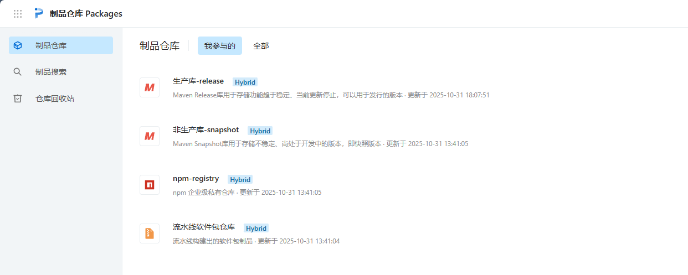
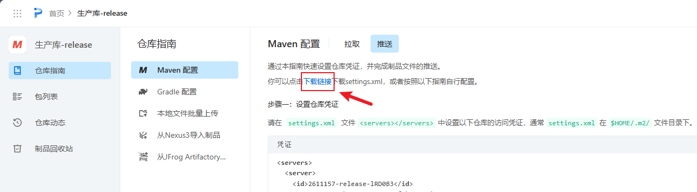
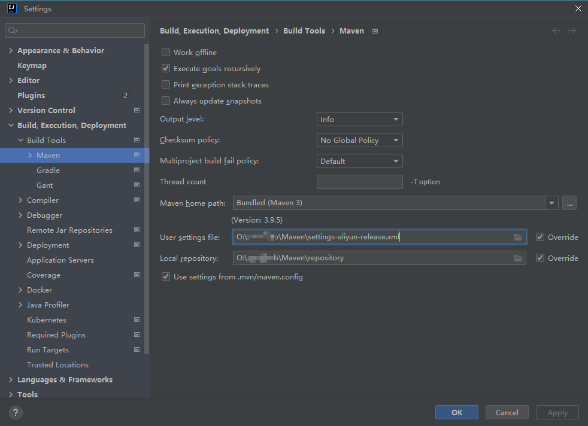
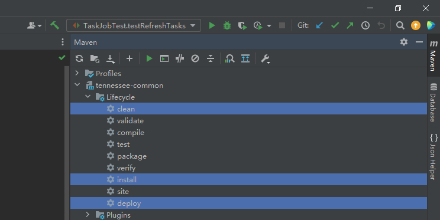
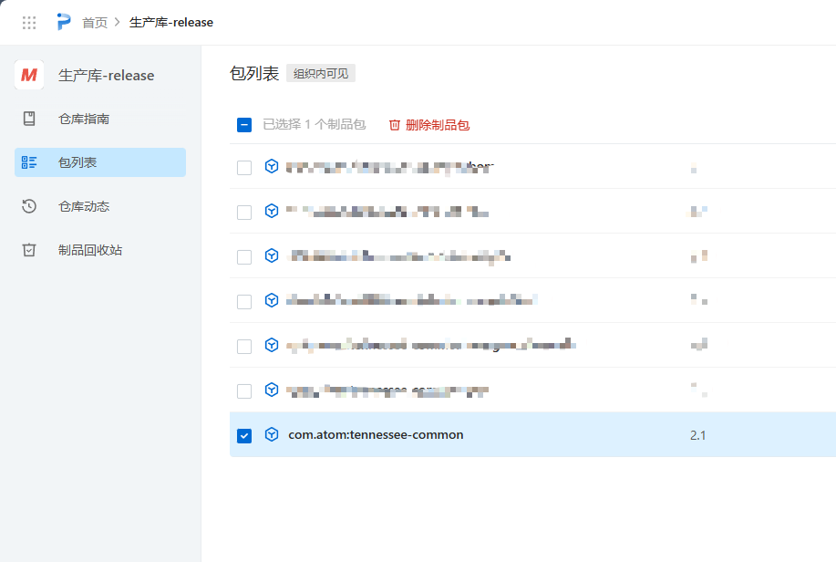
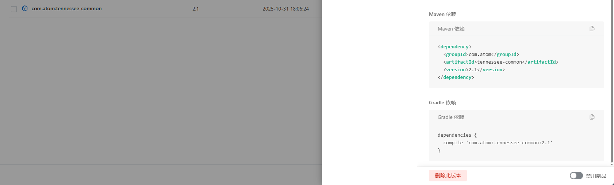

在本篇内容将介绍如何创建一个自定义的SpringBoot Starter，并将其打包发布到阿里云的私有制品仓库；这将包括从创建Maven项目开始，一直到最终部署的过程。

## 创建Maven项目
首先要创建一个maven项目，并在`pom.xml`当中添加所需要的依赖，例如
```xml
<groupId>com.atom</groupId>
<artifactId>tennessee-common</artifactId>
<version>2.1</version>
<packaging>pom</packaging>

<!-- ...省略部分内容 -->

<parent>
    <groupId>org.springframework.boot</groupId>
    <artifactId>spring-boot-starter-parent</artifactId>
    <version>2.7.12</version>
    <relativePath/>
</parent>

<dependencyManagement>
    <dependencies>
        <dependency>
            <groupId>com.google.guava</groupId>
            <artifactId>guava</artifactId>
            <version>32.1.3-jre</version>
        </dependency>
        <dependency>
            <groupId>commons-lang</groupId>
            <artifactId>commons-lang</artifactId>
            <version>2.6</version>
        </dependency>
        <dependency>
            <groupId>commons-codec</groupId>
            <artifactId>commons-codec</artifactId>
            <version>1.15</version>
        </dependency>
        <dependency>
            <groupId>com.alibaba</groupId>
            <artifactId>fastjson</artifactId>
            <version>2.0.49</version>
        </dependency>
        <dependency>
            <groupId>junit</groupId>
            <artifactId>junit</artifactId>
            <version>4.13.1</version>
            <scope>test</scope>
        </dependency>
    </dependencies>
</dependencyManagement>
```

## 自定义实现starter

然后再配置一个属性类，这样就能够在配置文件中根据固定前缀加属性就可以修改原有的配置，例如根据下方的设置，就可以通过`application.yml`当中定义`atom.common.job`的值来自定义属性值

```java
@Setter
@Getter
@ConfigurationProperties(prefix = "atom.common.job", ignoreInvalidFields = true)
public class TaskJobAutoProperties {

    /** 是否启用任务调度器 */
    private boolean enabled = true;

    /** 线程池大小 */
    private int poolSize = 10;

    /** 线程名称前缀 */
    private String threadNamePrefix = "atom-task-scheduler-";

    // ...省略其它配置
}
```

```yml
# 通用组件配置
atom:
  common:
    # 任务调度配置
    job:
      enabled: true
      pool-size: 5
      thread-name-prefix: "test-task-scheduler-"
      # ...省略其它配置
```

然后再创建一个相应的自动配置类，需要使用`@Configuration`和`@ConditionalOnXxx`注解来条件化地配置Bean

```java
@Configuration
@EnableScheduling
@EnableConfigurationProperties(TaskJobAutoProperties.class)
@ConditionalOnProperty(prefix = "atom.common.job", name = "enable", havingValue = "true", matchIfMissing = true)
public class TaskJobAutoConfig {

    private final Logger log = LoggerFactory.getLogger(TaskJobAutoConfig.class);

    @Bean("taskScheduler")
    public TaskScheduler taskScheduler(TaskJobAutoProperties properties) {
        ThreadPoolTaskScheduler scheduler = new ThreadPoolTaskScheduler();
        scheduler.setPoolSize(properties.getPoolSize());
        scheduler.setThreadNamePrefix(properties.getThreadNamePrefix());
        // ...省略部分配置
        scheduler.initialize();
        return scheduler;
    }
}
```

最后，就可以在`src/main/resource/META-INF/`目录下创建`spring.factories`文件，并在其中定义刚刚的自动配置类，这样就能让SpringBoot自动装配我们写的这个配置类

```yml
org.springframework.boot.autoconfigure.EnableAutoConfiguration=com.atom.ai.common.job.config.TaskJobAutoConfig
```

测试该项目可用后，就可以开始将maven项目打包并推送到私有或中心仓库当中

## 阿里云制品仓库

> 地址：https://packages.aliyun.com/
> 
> 填写个人信息申请后，就可以看到个人的制品仓库，包括了生产库和非生产库
>
> 

然后就可以根据仓库当中的`仓库指南 -> Maven配置 -> 推送`的配置教程进行本地配置

### 配置过程

根据提示下载设置好仓库访问凭证的`setting.xml`文件



下载的`setting.xml`自带账号密码，因此不需要再做修改；将新的`setting.xml`文件替换掉原本maven项目当中使用的文件，最好将新的xml文件重新命名，避免覆盖掉原有的文件；重新拉取依赖

这里新的xml文件重命名为`settings-aliyun-release.xml`



### 本地发布

在本地项目的maven管理中为需要发布的jar包点击`clean`、`install`和`deploy`，等待一段时间后就可以到远程的私有仓库查看是否已经将本地包发到了仓库中






点击该制品展开就可以查看该制品的一些元数据，通过下发提供的maven引入方式，就可以将该远程仓库的制品引入到其它项目中使用；当然，前提是其它项目中也需要按照`仓库指南 -> Maven配置 -> 拉取`当中的步骤进行`setting.xml`配置，否则将无法引入包

```xml
<dependency>
  <groupId>com.atom</groupId>
  <artifactId>tennessee-common</artifactId>
  <version>2.1</version>
</dependency>
```


