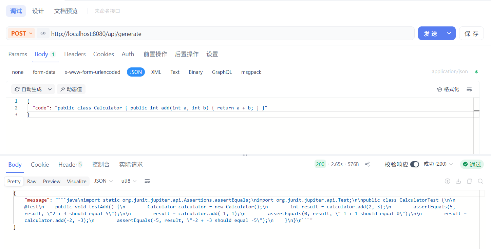

> https://spring.io/blog/2025/05/20/spring-ai-1-0-GA-released

Spring在不久前发布了Spring AI 1.0，可以使用`spring-ai-bom`包进行依赖管理，这个bom包声明了Spring AI特定版本所使用的所有依赖项的推荐版本，它只包含依赖管理，不包含插件声明或对Spring或Spring Boot的直接引用；

因此，代替了原本的0.8版本，现在可以在父项目中通过引入bom包来管理子项目当中的Spring AI相关的其它依赖，特别是对于Agent项目的所需依赖，可以按需引入无需关心版本问题

```xml
<dependencyManagement>
    <dependencies>
        <dependency>
            <groupId>org.springframework.ai</groupId>
            <artifactId>spring-ai-bom</artifactId>
            <version>1.0.0</version>
            <type>pom</type>
            <scope>import</scope>
        </dependency>
    </dependencies>
</dependencyManagement>
```

## 为啥需要Spring AI
在Spring AI出现之前，大多数Java项目接入大模型通常存在一些问题：

+ 直接调用第三方SDK（如OpenAI SDK），与业务代码强耦合
+ Prompt、模型参数、上下文管理逻辑散落在各处，巨难管理
+ 无法复用Spring生态已有的能力，配置管理、AOP、测试、监控等

好在Spring AI的出现为大模型提供一套**面向Spring应用**的抽象与编程模型

## 简单Demo
以一个简单的样例验证和展示在SpringBoot应用中快速接入ChatGPT，完成文本生成调用，而不引入任何复杂的上下文管理或业务逻辑；整个Demo的整体调用链路大致为:
1. 客户端向`/chat/generate`接口发送`POST`请求
2. 控制层即`ChatGPTController`接收请求，并将用户输入传递给Service层
3. Service层`ChatGPTService`使用`OpenAiChatModel`调用OpenAI对话模型
4. Spring AI返回`ChatResponse`对象
5. Controller将生成结果封装为`TestResponse`并返回给客户端

Demo依赖环境如下：
+ jdk: 21
+ maven: 3.8+
+ spring boot: 3.4.12
+ spring ai: 1.0.0

Demo项目结构如下：
```text
controller/
 └── ChatGPTController
service/
 └── ChatGPTService
dto/
 ├── TestRequest
 └── TestResponse
```
### 1. 引入依赖
```xml
<!-- 包管理依赖 -->
<dependencyManagement>
    <dependencies>
        <dependency>
            <groupId>org.springframework.ai</groupId>
            <artifactId>spring-ai-bom</artifactId>
            <version>1.0.0</version>
            <type>pom</type>
            <scope>import</scope>
        </dependency>
    </dependencies>
</dependencyManagement>

<dependencies>
    <dependency>
        <groupId>org.springframework.boot</groupId>
        <artifactId>spring-boot-starter-web</artifactId>
    </dependency>

    <dependency>
        <groupId>org.projectlombok</groupId>
        <artifactId>lombok</artifactId>
        <optional>true</optional>
    </dependency>
    <dependency>
        <groupId>org.springframework.boot</groupId>
        <artifactId>spring-boot-starter-test</artifactId>
        <scope>test</scope>
    </dependency>

    <dependency>
        <groupId>org.springframework.ai</groupId>
        <artifactId>spring-ai-starter-model-openai</artifactId>
    </dependency>
</dependencies>
```

因为只是简单的对话模型，所以在这里就只引用了基础的`spring-ai-starter-model-openai`openai模型依赖，像是其他的ai功能，RAG、MCP等等可以各取所需引入需要的包(`spring-ai-starter-vector-store-pgvector`、`spring-ai-starter-mcp-client-webflux`、`spring-ai-tika-document-reader`...)

> https://docs.springframework.org.cn/spring-ai/reference/api/chat/openai-chat.html

### 2. 配置openai
Spring AI现在可配置化写好请求大模型所需要的key等信息，模型、温度等参数可在`application.yml`中统一管理，避免硬编码在Service层，便于统一调整或通过配置中心动态修改；而且也能够通过`@ConfigurationProperties`、`@Value`等方式读取
```yml
spring:
  ai:
    openai:
      base-url: https://api.openai.com
      api-key: sk-xxx
```

### 3. DTO请求响应体
避免将Spring AI内部模型对象直接暴露给前端，为后续返回结构调整、增加metadata留出空间
```java
@Data
public class TestRequest {

    private String code;

}
```

```java
@Data
@AllArgsConstructor
public class TestResponse {

    private String message;

}
```

### 4. Service层
基于`OpenAiChatModel`构建对话模型，这里面的`OpenAiChatModel`由Spring自动装配（配置文件中写好了），API调用逻辑被高度抽象，简单易懂
```java
@Service
public class ChatGPTService {

    @Resource
    private OpenAiChatModel chatModel;

    public ChatResponse generateUnitTest(String code) {
        return chatModel.call(new Prompt(
                """
                为以下java代码生成对应的JUnit5单元测试代码（仅返回代码）:                    
                %s
                """.formatted(code),
                OpenAiChatOptions.builder().model("gpt-4o").build()
        ));
    }

}
```

### 5. Controller层
Controller通过调用Service方法，仅负责接收请求以及组装响应DTO，并向外暴露调用接口
```java
@RestController
@RequestMapping("/api")
public class ChatGPTController {

    @Resource
    private ChatGPTService chatGPTService;

    @PostMapping("/generate")
    public ResponseEntity<TestResponse> generate(@RequestBody TestRequest request) {
        ChatResponse chatResponse = chatGPTService.generateUnitTest(request.getCode());
        String content = chatResponse.getResult().getOutput().getText();
        return ResponseEntity.ok(new TestResponse(content));
    }

}
```

### 6. ApiFox/Postman 测试接口
通过传入一个简单的样例测试接口可用性
```json
{
  "code": "public class Calculator { public int add(int a, int b) { return a + b; } }"
}
```


成功`200 OK`

*★,°*:.☆(￣▽￣)/$:*.°★* 
