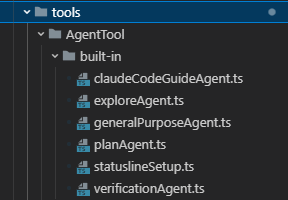
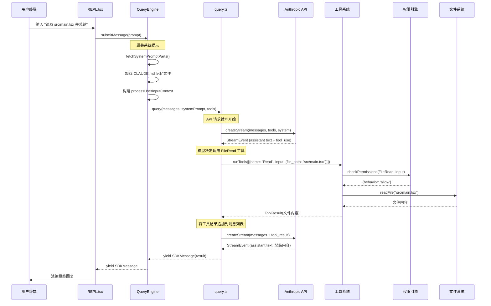
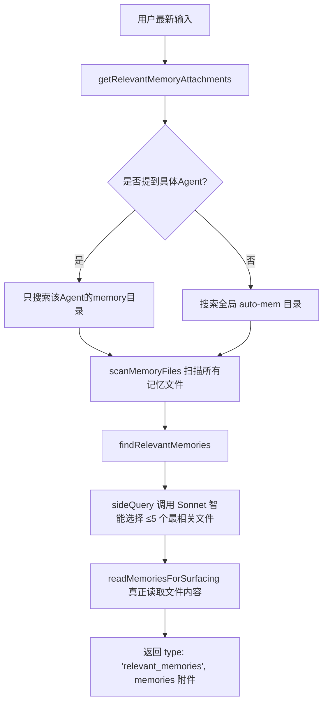
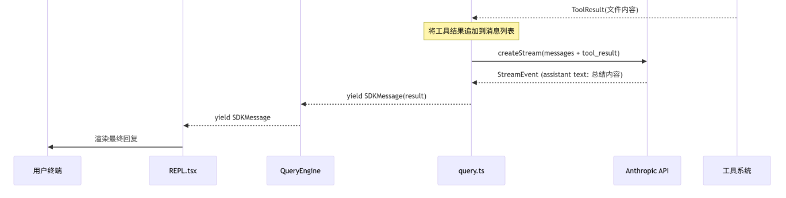

> 2026年3月31日，Anthropic在发布Claude Code CLI v2.1.88版本时，因打包配置疏忽，将一个59.8MB的Source Map文件上传至npm平台
> 
> 这份泄露的完整源码为我们提供了一个难得的机会，能够深入窥探 Claude Code 的内部架构设计
> 
> Claude Code 并非一个简单的命令行问答工具，而是一个设计精巧、工程化程度极高的**AI编码助手系统**。它包含了完整的多Agent协作架构、高性能查询引擎、上下文智能压缩机制、工具执行编排系统、权限控制体系以及一系列性能优化手段
> 
> **参考**：[RishabhK103/claude-code](https://github.com/RishabhK103/claude-code)

### 0. Claude Code 源码概览

```plaintext
src/
├── main.tsx              # CLI 主入口 — Commander.js 命令定义与启动编排
├── entrypoints/          # 多入口：cli.tsx, init.ts, mcp.ts, sdk/
├── QueryEngine.ts        # 查询引擎 — 管理对话生命周期
├── query.ts              # 核心查询循环 — API 调用 + 工具执行的状态机
├── Tool.ts               # 工具抽象层 — Tool<I,O,P> 泛型定义
├── tools.ts              # 工具注册表 — 动态组装工具池
├── tools/                # 40+ 工具实现：BashTool, FileEditTool, AgentTool...
├── types/                # 纯类型文件 — 打破循环依赖
├── state/                # 应用状态管理 — AppState, store
├── services/             # 外部服务交互
│   ├── api/              # Anthropic API 客户端
│   ├── mcp/              # MCP 协议实现
│   ├── compact/          # 上下文压缩服务
│   ├── analytics/        # 遥测与分析
│   └── tools/            # 工具编排引擎（并发执行）
├── hooks/                # React hooks（useCanUseTool 等）
├── components/           # Ink UI 组件
├── screens/              # TUI 页面（权限对话框、设置等）
├── commands/             # 斜杠命令系统
├── skills/               # 技能系统（可扩展的命令集）
├── plugins/              # 插件系统
├── coordinator/          # 多 Agent 协调器
├── context/              # 上下文管理
├── migrations/           # 配置迁移脚本
├── utils/                # 工具函数集（最大的目录）
│   ├── permissions/      # 权限子系统
│   ├── model/            # 模型选择与配置
│   ├── settings/         # 分层配置系统
│   ├── sandbox/          # 命令沙箱
│   └── ...
├── bootstrap/            # 启动状态管理
├── remote/               # 远程会话管理
├── server/               # Direct Connect 服务端
├── assistant/            # 助手模式（KAIROS）
└── voice/                # 语音输入
```

Claude Code，以下称CC，整体结构模块众多，包含了30+顶层模块，具体可以划分为5个核心层次，每层之间下层向上层提供抽象，上层依赖下层具体实现。

+ **layer 1 CLI&UI**：最顶层向外提供交互以及终端渲染等，核心包括`main.tsx`使用`Commander.js`定义完整的CLI接口；`REPL.tsx`提供交互式终端命令行REPL（Read–Eval–Print Loop）交互界面。
+ **layer 2 Query Engine**：核心代码包括`QueryEngine.ts`、`query.ts`、`queryContext.ts`分别处理会话生命周期管理、核心查询循环、系统提示词组装。
+ **layer 3 Tools**：主要定义了工具的抽象接口和相关执行引擎，包括`tools.ts`工具注册表（通过`bun:bundle`的`feature`进行死代码消除，控制不同的角色或者模式下使用不同的工具）以及`Tool.ts`工具抽象接口，在这之上实现`toolExecution.ts`单工具执行以及`toolOrchestration.ts`并发控制（工具被分为并发安全和串行执行两种模式，read-only的工具一般就是并发执行，而non-read-only为串行执行）

```typescript
// src/tools.ts

// 大量使用 feature() 函数进行编译时死代码消除(Dead Code Elimination)
// Check if a feature flag is enabled at compile time.
// This function is replaced with a boolean literal ( or ) at bundle time, enabling dead-code elimination.
// The bundler will remove unreachable branches.    ----https://bun.com/reference/bun/bundle/feature
const SleepTool =
  feature('PROACTIVE') || feature('KAIROS')
    ? require('./tools/SleepTool/SleepTool.js').SleepTool
    : null
const cronTools = feature('AGENT_TRIGGERS')
  ? [
      require('./tools/ScheduleCronTool/CronCreateTool.js').CronCreateTool,
      require('./tools/ScheduleCronTool/CronDeleteTool.js').CronDeleteTool,
      require('./tools/ScheduleCronTool/CronListTool.js').CronListTool,
    ]
  : []
const RemoteTriggerTool = feature('AGENT_TRIGGERS_REMOTE')
  ? require('./tools/RemoteTriggerTool/RemoteTriggerTool.js').RemoteTriggerTool
  : null
```

```typescript
// src/services/tools/toolOrchestration.ts

export async function* runTools(
  toolUseMessages: ToolUseBlock[],  // LLM输出的tool call列表
  assistantMessages: AssistantMessage[],  // 当前对话上下文中的 assistant 历史消息
  canUseTool: CanUseToolFn,  // 工具权限检查函数
  toolUseContext: ToolUseContext,  // 工具执行的共享上下文
): AsyncGenerator<MessageUpdate, void> {
  let currentContext = toolUseContext  // 后续工具的执行都会逐步修改这个context
  // partitionToolCalls(): 将工具拆分为多个batch，多个连续的read-only，或者单个non-read-only工具
  for (const { isConcurrencySafe, blocks } of partitionToolCalls(
    toolUseMessages,
    currentContext,
  )) {
    // 并发安全的工具（Glob、Grep、FileRead...）并行执行
    if (isConcurrencySafe) {
      // 暂存context修改：并发执行时不能直接修改共享context
      const queuedContextModifiers: Record<
        string,
        ((context: ToolUseContext) => ToolUseContext)[]
      > = {}
      // Run read-only batch concurrently
      for await (const update of runToolsConcurrently(
        blocks,
        assistantMessages,
        canUseTool,
        currentContext,
      )) {
        if (update.contextModifier) {
          const { toolUseID, modifyContext } = update.contextModifier
          if (!queuedContextModifiers[toolUseID]) {
            queuedContextModifiers[toolUseID] = []
          }
          queuedContextModifiers[toolUseID].push(modifyContext)
        }
        // 实时流式返回，此时context还没修改
        yield {
          message: update.message,
          newContext: currentContext,
        }
      }
      // 批次结束后统一更新context
      for (const block of blocks) {
        const modifiers = queuedContextModifiers[block.id]
        if (!modifiers) {
          continue
        }
        // 按照tool call的顺序应用modifier
        for (const modifier of modifiers) {
          currentContext = modifier(currentContext)
        }
      }
      // 最终context更新通知
      yield { newContext: currentContext }
    } else {
      // 非并发安全的工具串行执行
      // Run non-read-only batch serially
      for await (const update of runToolsSerially(
        blocks,
        assistantMessages,
        canUseTool,
        currentContext,
      )) {
        // 执行完一个就更新一次context
        if (update.newContext) {
          currentContext = update.newContext
        }
        yield {
          message: update.message,
          newContext: currentContext,
        }
      }
    }
  }
}
```

+ **layer 4 Agent**：这一层主要围绕agent，包括支持agent嵌套以及任务管理，`src/tools/AgentTool/`目录下就包含了子agent创建，每个子agent拥有独立的`QueryEngine`实例，实现递归式的任务分解；以及`coordinatorMode.ts`下多agent协调

	

	CC内部提供的agent包括：

	1. `claudeCodeGuideAgent`：专门回答CC/SDK/API使用问题的内置Agent，并根据用户环境动态生成system prompt和工具能力；
	2. `exploreAgent`：一个高速只读的专门用于搜索代码库的子代理，通过grep/glob/read等工具快速定位代码信息，并将结果返回给主 Agent进行分析，有明确的禁止操作，只提供只读权限，核心能力被限制为3个：文件搜索、内容搜索、文件阅读。而且这个agent被定义至少进行3次查询`export const EXPLORE_AGENT_MIN_QUERIES = 3`，防止只搜索一次就返回；通过定义一段提示词文本`EXPLORE_WHEN_TO_USE`告诉agent执行的时机，太长了就不贴了，包括找文件、搜代码、理解代码等这些场景，同时调用时还需要指定3个level，`quick`、`medium`以及`very thorough`；
	3. `generalPurposeAgent`：它是一个通用目标子代理，代码很短，但它是一个能力较完整的“研究型子代理”，用于处理复杂任务或代码探索。其主要是通过一个共享前缀`SHARED_PREFIX`以及共享行为指南`SHARED_GUIDELINES`这两块提示词，先是定义所有行为的基本目标，再用prompt规定agent的优势，说人话就是这个agent擅长大规模代码搜索、系统架构分析、复杂问题调查、多步骤任务；然后通过`getGeneralPurposeSystemPrompt()`组装系统提示词，并允许这个agent使用所有tool`tools: ['*']`；
	4. `planAgent`（任务规划）、`statuslineSetup`（配置工具）、`verificationAgent`（结果验证）：剩下的agent与上面的类似，也是通过一大段prompt定义它的能力组合，每个`BuiltInAgentDefinition`就是一种Agent角色+能力+使用场景+系统提示词的组合，主Agent在需要时调用这些Agent来完成任务；核心字段：

```typescript
type BuiltInAgentDefinition = {
	agentType: string  // Agent名称
	whenToUse: string  // 什么时候调用
	tools?: string[]  // 允许使用的工具
	disallowedTools?: string[]  // 禁止使用的工具
	model?: string  // 使用的模型
	getSystemPrompt: () => string  // Agent的系统提示词
}
```

+ **layer 5 Protocol&Services**：基础设施层，包括API客户端、MCP协议的实现、权限引擎和上下文压缩服务，具体为`services/`包下的`api/`、`mcp/`、`permission/`以及`compact/`



在一次对话的流程中，系统内部的执行分为多个阶段：
### 1. 消息组装

#### 1.1 REPL

`REPL.tsx`也就是用户在终端和CC对话的整个UI、输入处理、消息渲染、状态管理的完整实现，大约5k行的代码，整体的流程大致为：用户输入处理、消息列表、与agent通信、token预算管理、多agent协作、权限管理、通知系统、UI渲染。

*\*这里只着重看看agent通信与多agent协作部分，其它的方法没有细细研究..*

| 名称           | 实体                               | 核心方法/类                                                                | 职责                              |
| ------------ | -------------------------------- | --------------------------------------------------------------------- | ------------------------------- |
| 主线程Agent     | Main Thread                      | `mainThreadAgentDefinition`, `useMainLoopModel()`                     | 负责用户交互、Prompt输入、工具调用协调          |
| 子Agent       | Local Agent, In-process Teammate | `LocalAgentTask`, `InProcessTeammateTask`                             | 独立执行子任务，可在进程内或后台运行              |
| Swarm Worker | Swarm Worker                     | `isSwarmWorker()`, `pendingWorkerRequest`, `workerSandboxPermissions` | 分布式Worker，通过Mailbox通信           |
| Remote Agent | Remote Agent                     | `remoteSessionConfig`, `restoreRemoteAgentTasks`                      | 通过SSH、Direct Connect等运行的远程Agent |
| 任务调度         | Task System                      | `tasks`(AppState), `TaskListV2`, `useTasksV2WithCollapseEffect`       | 统一管理所有Agent的生命周期                |

在CC这一套Multi-Agent结构中，由主线程做大脑，多个子agent做执行单元，每个agent都有各自独立的工作集、sandbox权限、文件历史，而且agent可完全后台运行，主REPL不阻塞。在REPL中，所有子Agent不会直接与LLM挂钩，而是通过构造`AgentTask`，其中定义了两类任务：

+ 本地agent处理的`LocalAgentTask`
+ 子agent处理的`InProcessTeammateTask`

```typescript
import { isLocalAgentTask, queuePendingMessage, appendMessageToLocalAgent, type LocalAgentTaskState } 
from '../tasks/LocalAgentTask/LocalAgentTask.js';
import { injectUserMessageToTeammate, getAllInProcessTeammateTasks } from '../tasks/InProcessTeammateTask/InProcessTeammateTask.js';
```

对于收到的本地agent任务`LocalAgentTask`，当终端收到用户输入时，会把用户的消息加入到agent的message history；如果当前agent正在执行任务，新消息不会立即执行，而是加入到`queuePendingMessage`等待队列，避免agent的推理中途被打断；如果agent不在运行状态，这里触发agent runtime推理，通过`resumeAgentBackground()`恢复并继续执行一个后台subagent任务，具体为：

1. 从磁盘恢复agent的历史会话`transcript`
2. 还原agent执行上下文（system prompt, worktree, tools, state）
3. 重新注册agent任务
4. 在后台启动agent生命周期Agent Loop
5. 让该后台agent继续推理，调用工具并产生结果

如果收到的是子agent处理的任务`InProcessTeammateTask`，就会通过`injectUserMessageToTeammate()`将用户消息注入到teammate的待处理队列中，CC对于teammate的定义：

> *"InProcessTeammateTask - Manages in-process teammate lifecycle
>  This component implements the Task interface for in-process teammates.
>  Unlike LocalAgentTask (background agents), in-process teammates: 1. Run in the same Node.js process using AsyncLocalStorage for isolation. 2. Have team-aware identity (agentName@teamName). 3. Support plan mode approval flow. 4. Can be idle (waiting for work) or active (processing)"*

这类特殊的agent，in-process teammate，与之前的`LocalAgentTask`后台subagent不同，它是执行在同一nodejs进程当中，用来构建一系列协作agent（Agent Swarm）。

```typescript
const onAgentSubmit = useCallback(async (input: string, task: InProcessTeammateTaskState | LocalAgentTaskState, helpers: PromptInputHelpers) => {
	if (isLocalAgentTask(task)) {
	  appendMessageToLocalAgent(task.id, createUserMessage({
		content: input
	  }), setAppState);
	  if (task.status === 'running') {
		queuePendingMessage(task.id, input, setAppState);
	  } else {
		void resumeAgentBackground({
		  agentId: task.id,
		  prompt: input,
		  toolUseContext: getToolUseContext(messagesRef.current, [], new AbortController(), mainLoopModel),
		  canUseTool
		}).catch(err => {
		  logForDebugging(`resumeAgentBackground failed: ${errorMessage(err)}`);
		  addNotification({
			key: `resume-agent-failed-${task.id}`,
			jsx: <Text color="error">
				  Failed to resume agent: {errorMessage(err)}
				</Text>
			priority: 'low'
		  });
		});
	  }
	} else {
	  injectUserMessageToTeammate(task.id, input, setAppState);
	}
	setInputValue('');
	helpers.setCursorOffset(0);
	helpers.clearBuffer();
}, [setAppState, setInputValue, getToolUseContext, canUseTool, mainLoopModel, addNotification]);
```

#### 1.2 QueryEngine

> *"QueryEngine owns the query lifecycle and session state for a conversation.
> It extracts the core logic from ask() into a standalone class that can be used by both the headless/SDK path and (in a future phase) the REPL.
> One QueryEngine per conversation. Each submitMessage() call starts a new turn within the same conversation. State (messages, file cache, usage, etc.) persists across turns."*

QueryEngine简单来说就是CC专门为非交互式或者SDK等场景设计的查询引擎，它的核心作用可以简单概括为：**负责管理一次完整会话conversation的生命周期和状态，把一个prompt转成一连串规范的SDKMessage，同时在多次调用间持久化消息历史、文件缓存、token用量、权限记录等状态**

QueryEngine最核心的方法就是`submitMessage()`，它通过输入一个prompt（string或者是ContentBlockParam数组）返回一个异步生成器`AsyncGenerator<SDKMessage>`，即流式返回系统初始化消息assistant回复、工具结果、compact boundary、最终result等，把整个CC查询流程封装为一个SDK格式的消息流；

当`QueryEngine.submitMessage()`被调用时，系统会去组装系统提示词，系统提示由多个部分组成：默认提示（包含角色定义、工具使用指南、安全规则）、用户上下文（git状态、工作目录信息）、系统上下文（操作系统、shell类型），以及可选的记忆文件和自定义追加内容。

```typescript
async *submitMessage(...) {
  // 1. 前置准备
  this.discoveredSkillNames.clear();
  setCwd(cwd);
  const persistSession = !isSessionPersistenceDisabled();

  // 2. 包装 canUseTool（记录所有可用工具）
  const wrappedCanUseTool = async (...) => { ... }

  // 3. 初始化 model、thinkingConfig、appState
  const initialMainLoopModel = ...
  const initialThinkingConfig = ...

  // 4. 构建系统提示，获取系统提示的各个组成部分
  const { defaultSystemPrompt, userContext, systemContext } = 
    await fetchSystemPromptParts({ ... });
  
  const memoryMechanicsPrompt = ... // 如果有 CLAUDE_COWORK_MEMORY_PATH_OVERRIDE
  // 组装最终的系统提示
  const systemPrompt = asSystemPrompt([customPrompt, memoryMechanicsPrompt, appendSystemPrompt]);

  // 5. 构建 processUserInputContext（上下文容器）
  let processUserInputContext: ProcessUserInputContext = { ... }

  // 6. 处理 orphanedPermission
  if (orphanedPermission && !this.hasHandledOrphanedPermission) { ... }

  // 7. 处理用户输入
  const {
    messages: messagesFromUserInput,
    shouldQuery,
    allowedTools,
    model: modelFromUserInput,
    resultText,
  } = await processUserInput({ input: prompt, ... });

  // 8. 追加消息+立即持久化 transcript
  this.mutableMessages.push(...messagesFromUserInput);
  if (persistSession) {
    await recordTranscript(messages);   // 用户消息先落盘
  }

  // 9. 如果是纯 slash command（shouldQuery === false）
  if (!shouldQuery) {
    // 直接 yield 本地命令输出 + result 消息并返回
    ... 
    yield { type: 'result', subtype: 'success', ... };
    return;
  }

  // 10. 否则进入真正的 query 循环（query.ts）
  for await (const message of query({ 
    messages,
    systemPrompt,
    userContext,
    systemContext,
    canUseTool: wrappedCanUseTool,
    toolUseContext: processUserInputContext,
    ...
  })) {
    // 11. 消息分类处理 + yield SDK 格式
    if (message.type === 'assistant' || 'user' || 'compact_boundary') {
      messages.push(message);
      if (persistSession) recordTranscript(...);
    }

    switch (message.type) {
      case 'assistant':   yield* normalizeMessage(message); break;
      case 'progress':    yield* normalizeMessage(message); break;
      case 'user':        yield* normalizeMessage(message); break;
      case 'attachment':  // 结构化输出、max_turns_reached 等
      case 'system':      // compact_boundary、api_error 等
      case 'tool_use_summary':
      case 'stream_event': // 如果 includePartialMessages
        ...
    }

    // 各种终止条件
    if (maxBudgetUsd 超限) yield error_max_budget_usd 并 return;
    if (structured output 重试超限) yield error_max_structured_output_retries 并 return;
  }

  // 12. 循环结束 → 最终 result 消息
  const result = messages.findLast(...);
  if (!isResultSuccessful(result, lastStopReason)) {
    yield { type: 'result', subtype: 'error_during_execution', ... };
  } else {
    yield { type: 'result', subtype: 'success', result: textResult, ... };
  }
}
```

### 2. 循环查询

通过看了REPL以及QueryEngine源码可以发现，系统的核心循环查询方法来自于`query.ts`的`query()`方法，它也是通过返回一个异步生成器`AsyncGenerator`实现了API调用和工具执行的交替循环

```typescript
export async function* query(
  params: QueryParams,
): AsyncGenerator<
  | StreamEvent
  | RequestStartEvent
  | Message
  | TombstoneMessage
  | ToolUseSummaryMessage,
  Terminal
> {
  const consumedCommandUuids: string[] = []
  const terminal = yield* queryLoop(params, consumedCommandUuids)
  for (const uuid of consumedCommandUuids) {
    notifyCommandLifecycle(uuid, 'completed')
  }
  return terminal
}
```

可以看出`query()`及其调用的`queryLoop()`是CC最核心最复杂的查询引擎实现，它负责了整个多轮Agent对话的完整生命周期，从用户prompt到最终结果，包括上下文管理、API 流式调用、工具执行、自动压缩、智能恢复等几乎所有智能行为；

当`queryLoop()`正常结束后，通知所有被消费的命令`notifyCommandLifecycle()`，最终返回一个`Terminal`对象；而`queryLoop()`就是整个文件的灵魂，一个while (true)无限循环，代表一次完整的Agentic Turn，其中可能包含多次模型调用及工具执行，每次while(true)大致为以下几个阶段：

1. **初始化**：从`state`解构出当前的`message`、`toolUseContext`等，启动**相关记忆预取**（Relevant memory prefetch）以及**Skill发现预取**（Skill discovery prefetch）；**相关记忆预取**就是在每次查询循环开始时，异步、提前、非阻塞地去搜索和加载可能相关的长期记忆文件，`startRelevantMemoryPrefetch`核心方法就是把查找+读取操作提前到后台，等模型回复和工具执行的同时后台偷偷完成，等工具执行结束后，如果预取已经完成，就把加载到的记忆以attachment的形式注入对话，让CC能直接看到；而**Skill发现预取**这个方法在`query.ts`里提到它是从`./services/skillSearch/prefetch.ts`里导入的，这段源码似乎缺失，但从`query.ts`中的调用方式可以确定它的实现模式和内存预取几乎一致，它同样是异步提前启动，根据当前消息上下文搜索可能相关的Skill返回一个类似的可追踪Promise+Disposable对象，并在工具执行后注入为attachment

> *"Skill discovery prefetch — per-iteration (uses findWritePivot guard that returns early on non-write iterations). Discovery runs while the model streams and tools execute; awaited post-tools alongside the memory prefetch consume. Replaces the blocking assistant_turn path that ran inside getAttachmentMessages (97% of those calls found nothing in prod). Turn-0 user-input discovery still blocks in userInputAttachments — that's the one signal where there's no prior work to hide under."*

<!-- markdownlint-capture -->
<!-- markdownlint-disable -->
> *粗略看了下相关记忆预取的部分内容，感觉挺有意思的，放到了2.1小节*
{: .prompt-tip }
<!-- markdownlint-restore -->
2. **上下文压缩**：在`queryLoop()`的每次迭代，也就是每一轮模型调用前，都会执行一段上下文压缩链，防止上下文`messageForQuery`无限膨胀token爆炸。它的整个压缩链流程为：
	1. **工具结果预算控制**`applyToolResultBudget`：对所有`tool_result`的内容大小进行硬限制，把超大的工具输出，尤其是文件读写结果，替换成占位符或摘要；
	2. **Snip Compact**：`HISTORY_SNIP`下的特性，猜测应该是移除重复签名块，清理一些不需要长期保留的系统消息等比较轻量级的系统清理；
	3. **Microcompact**：它专门针对那些体积巨大但重要性随时间下降的工具结果去进行micro compact，`microCompact.ts`的`microcompactMessages()`方法提出它的两种实现路径：一是**时间触发式**（Time-based Microcompact），当前query距离上一次assistant回复已经过去较长时间（由配置文件`gapThresholdMinutes`定义）就会把较早的可压缩工具结果的内容全部替换成一行占位符，只保留最近`keepRecent`条工具结果；二是**缓存编辑式**（Cached Microcompact），它会受特性`CACHED_MICROCOMPACT`控制，不删除本地消息内容，而是利用Anthropic的cache_edits API功能，在API请求层面告诉服务器把哪些tool_result从缓存前缀里删掉；
	4. **Context Collapse**：把多轮对话折叠成结构化摘要，摘要保存在单独的collapse store中，主消息列表只保留折叠后的视图，但是原始消息仍在磁盘，随时可展开；
	5. **Auto Compact**：当上面所有轻量压缩都无法让token数达标时，才执行最重的总结式压缩，它会把大量历史对话总结成几条简短的summary消息，具体是：先执行较为轻量的**会话记忆压缩**（Session Memory Compact）`trySessionMemoryCompaction`，把大量历史对话打包成一个持久化的外部记忆文件，然后只保留最近的消息；如果会话记忆压缩还是无法满足token需求的话，才会fallback到传统的完整压缩`compactConversation`，在这里通过调用Sonnet对历史会话进行总结，最终构造一个新的消息列表。

  ```typescript
  // 1. 工具结果预算控制
  messagesForQuery = await applyToolResultBudget(...)

  // 2. Snip Compact(HISTORY_SNIP)
  if (feature('HISTORY_SNIP')) { ... }

  // 3. Microcompact(Cached Microcompact)
  const microcompactResult = await deps.microcompact(...)

  // 4. Context Collapse(CONTEXT_COLLAPSE)
  if (feature('CONTEXT_COLLAPSE') && contextCollapse) { ... }

  // 5. Auto Compact
  const { compactionResult, ... } = await deps.autocompact(...)
  ```
3. **准备API调用**：此时，在构建了完整系统提示词`fullSystemPrompt`后，通过`getRuntimeMainLoopModel()`决定当前loop所使用的主模型，检查token blocking limit是否超过200k；
4. **调用模型**：这里真正发起流式请求，通过`callModel()`调用Anthropic SDK支持streaming fallback以及StreamingToolExecutor（边流式输出边执行工具），同时还包括了withhold机制，也就是当出现prompt-too-long、max_output_tokens、media size error等可恢复错误会被暂时withhold，不yield给调用方，留给后续恢复逻辑处理；
5. **工具执行**：如果有`tool_use`，使用StreamingToolExecutor或传统的runTools，执行工具后产生`tool_result`，异步生成一个`tool_use_summary`，并将它和前面提到的memory attachments、skill discovery等附件结果一起做后处理；
6. **终止条件**：如果`!needsFollowUp`即发生了内部错误或者流式输出出错，需要执行执行Stop Hooks，处理各种恢复，如果有工具执行结果，就会去构建`next`状态，更新`state`进入下一轮模型调用；循环会在以下情况终止：
	+ `complete`正常结束
	+ `aborted_streaming`、`aborted_tools`用户提前终止
	+ `max_turns`达到最大轮次
	+ `prompt_too_long`、`image_error`、`model_error`出错情况
	+ `stop_hook_prevented`由stop hook阻止进一步执行
	+ `blocking_limit`token硬限制

#### 2.1 相关记忆预取

```typescript
using pendingMemoryPrefetch = startRelevantMemoryPrefetch(
	state.messages,
	state.toolUseContext,
)
```

由于读取记忆文件比较耗时，如果像执行流程一样等到模型真正需要时再去读，会明显拖慢响应速度，所以CC在这一块就设计了像`startRelevantMemoryPrefetch()`这样的预取能力，它会去传入当前消息`state.message`以及工具上下文`state.toolUseContext`，然后看到`startRelevantMemoryPrefetch()`方法里面，它会先去判断，只有开启了自动记忆且特性开关为`tengu_moth_copse`时才去预取

```typescript
if (!isAutoMemoryEnabled() || !getFeatureValue_CACHED_MAY_BE_STALE('tengu_moth_copse', false)) {
  return undefined;
}
```

其次，找到最近一条真正的用户消息，如果输入太短，直接跳过，减少无用工作

```typescript
const lastUserMessage = messages.findLast(m => m.type === 'user' && !m.isMeta);
if (!lastUserMessage) return undefined;

const input = getUserMessageText(lastUserMessage);
// 单字提示缺乏足够上下文，没必要预取
if (!input || !/\s/.test(input.trim())) {
  return undefined;
}
```

检查当前会话已经“浮出”（surfaced）的记忆总大小是否已经太多，也就是记的东西太多啦，就不再预取新记忆，避免内存爆炸

```typescript
const surfaced = collectSurfacedMemories(messages);
if (surfaced.totalBytes >= RELEVANT_MEMORIES_CONFIG.MAX_SESSION_BYTES) {
  return undefined;
}
```

之后就可以**启动异步预取**，通过调用核心函数`getRelevantMemoryAttachments()`传入当前输入、当前活跃的AgentDifinition、已读文件缓存、最近成功使用的工具以及已浮出的记忆路径，返回可追踪的handle

```typescript
// Chained to the turn-level abort so user Escape cancels the sideQuery
// immediately, not just on [Symbol.dispose] when queryLoop exits.
const controller = createChildAbortController(toolUseContext.abortController)
const firedAt = Date.now()
const promise = getRelevantMemoryAttachments(
	input,  // 最新用户输入
	toolUseContext.options.agentDefinitions.activeAgents,
	toolUseContext.readFileState,
	collectRecentSuccessfulTools(messages, lastUserMessage),
	controller.signal,
	surfaced.paths,  // 已浮出的记忆路径
).catch(e => {
	if (!isAbortError(e)) {
	  logError(e)
	}
	return []
})

const handle: MemoryPrefetch = {
	promise,
	settledAt: null,  // 预取什么时候完成
	consumedOnIteration: -1,  // 在第几次循环中被真正消费
	[Symbol.dispose]() {  // using 语句结束时自动调用
	  controller.abort()
	  logEvent('tengu_memdir_prefetch_collected', {
		hidden_by_first_iteration:
		  handle.settledAt !== null && handle.consumedOnIteration === 0,
		consumed_on_iteration: handle.consumedOnIteration,
		latency_ms: (handle.settledAt ?? Date.now()) - firedAt,
	  })
	},
}
void promise.finally(() => {
	handle.settledAt = Date.now()
})
return handle
```

在真正的记忆搜索+加载的实现`getRelevantMemoryAttachments()`中，系统先会去决定搜索哪些目录，如果用户输入中@agent-xxx提到了某个具体的agent，那么就只会搜索该agent的专属记忆库，反之则搜索全局`getAutoMemPath()`；

那么系统是如何确定要搜索的相关记忆是哪些呢？

> *"Find memory files relevant to a query by scanning memory file headers and asking Sonnet to select the most relevant ones. Returns absolute file paths + mtime of the most relevant memories (up to 5). Excludes MEMORY.md (already loaded in system prompt). mtime is threaded through so callers can surface freshness to the main model without a second stat. `alreadySurfaced` filters paths shown in prior turns before the Sonnet call, so the selector spends its 5-slot budget on fresh candidates instead of re-picking files the caller will discard."*

来到`findRelevantMemories.ts`可以发现，系统做了两件事：

一是扫描目录，读取每个记忆文件的头部（header），得到文件名+描述+mtime

```typescript
const memories = (await scanMemoryFiles(memoryDir, signal))
  .filter(m => !alreadySurfaced.has(m.filePath))
```

二是使用一个小模型（Sonnet）做相关性判断

```typescript
const result = await sideQuery({
  model: getDefaultSonnetModel(),
  system: SELECT_MEMORIES_SYSTEM_PROMPT,
  skipSystemPromptPrefix: true,
  messages: [
	{
	  role: 'user',
	  content: `Query: ${query}\n\nAvailable memories:\n${manifest}${toolsSection}`,
	},
  ],
  max_tokens: 256,
  output_format: {
	type: 'json_schema',
	schema: {
	  type: 'object',
	  properties: {
		selected_memories: { type: 'array', items: { type: 'string' } },
	  },
	  required: ['selected_memories'],
	  additionalProperties: false,
	},
  },
  signal,
  querySource: 'memdir_relevance',
})
```

这里通过一个严格的硬提示词`SELECT_MEMORIES_SYSTEM_PROMPT`去规范记忆搜索AI的行为，大致意思就是让AI最多选5个、必须确定有用才选、最近使用的工具的参考文档不要选、但工具的警告或已知问题要选等等...同时强制JSON Schema，保证返回的是干净的`selected_memories: string[]`数组。最后把挑选出的文件内容以`relevant_memories`附件形式注入对话。

整个记忆预取的过程见：



### 3. 工具执行

在CC中，核心的工具调用接口位于`Tool.ts`中，它定义了每一个Tool必须遵守的统一接口规范，在这个文件中，最关键的就是工具调用相关接口：

```typescript
call(...): Promise<ToolResult<Output>> // 真正执行工具
checkPermissions(...): Promise<PermissionResult> // 权限检查
validateInput?(...): Promise<ValidationResult> // 输入合法性校验
```

在真正call完工具执行完毕后，就会通过`ToolResult<T>`返回结果，这里的`contextModifier`能够在一个工具被使用后，去改变原有的上下文，当然它在这里并不是直接去修改原上下文，而是通过返回一个修改函数modifier从而去保证并发性

```typescript
export type ToolResult<T> = {
  data: T  // 工具输出数据
  newMessages?: (  // 可选的附加消息
    | UserMessage
    | AssistantMessage
    | AttachmentMessage
    | SystemMessage
  )[]
  // contextModifier is only honored for tools that aren't concurrency safe.
  contextModifier?: (context: ToolUseContext) => ToolUseContext  // 上下文修改器
  /** MCP protocol metadata (structuredContent, _meta) to pass through to SDK consumers */
  mcpMeta?: {
    _meta?: Record<string, unknown>
    structuredContent?: Record<string, unknown>
  }
}
```

除此之外，还包括返回模型的工具描述，供模型进行工具选择，以及输入输出Schema的定义等等，还是比较全面的工具调用接口

```typescript
export type Tool<Input = AnyObject, Output = unknown, P = ToolProgressData> = {
  name: string                    // 工具名称
  aliases?: string[]              // 别名
  
  // ---------- 调用相关 ----------
  call(...): Promise<ToolResult<Output>>     // 真正执行工具
  checkPermissions(...): Promise<PermissionResult>   // 权限检查
  validateInput?(...): Promise<ValidationResult>     // 输入合法性校验

  // ---------- 描述与提示 ----------
  prompt(...): Promise<string>               // 返回给模型的工具描述
  description(...): Promise<string>          // 详细描述
  userFacingName(...): string                // UI 上显示的名字

  // ---------- 输入输出 Schema ----------
  inputSchema: ZodSchema                     // 输入参数的 Zod Schema
  inputJSONSchema?: ToolInputJSONSchema      // MCP 工具可直接提供 JSON Schema
  outputSchema?: ZodType                     // 输出 Schema

  // ---------- UI 渲染相关 ----------
  renderToolUseMessage(...)                  // 渲染工具调用时的 UI
  renderToolResultMessage(...)               // 渲染工具执行结果的 UI
  renderToolUseProgressMessage(...)          // 渲染执行中的进度
  renderToolUseRejectedMessage(...)          // 权限拒绝时的 UI
  renderToolUseErrorMessage(...)             // 执行失败时的 UI
  renderGroupedToolUse?(...)                 // 多个同类工具合并渲染

  // ---------- 其他重要方法 ----------
  isEnabled(): boolean                       // 当前是否可用
  isReadOnly(input): boolean                 // 是否只读工具
  isDestructive?(input): boolean             // 是否破坏性操作
  isConcurrencySafe(input): boolean          // 是否支持并发执行
  isSearchOrReadCommand?(input)              // 是否是搜索/读取类命令（用于折叠显示）
  maxResultSizeChars: number                 // 结果最大字符数（超大时自动持久化）
  toAutoClassifierInput(input)               // 给自动权限分类器用的简化输入
  ...
}
```

值得注意的是，每个工具调用都要经过权限引擎的审查，例如`checkPermissions()`方法，这里面的`PermissionResult`就是一个权限判别集合，一般权限逻辑在`permissions.ts`中。

```typescript
// src/Tool.ts

checkPermissions(
  input: z.infer<Input>,
  context: ToolUseContext,
): Promise<PermissionResult>

// src/types/permissions.ts
export type PermissionResult<
  Input extends { [key: string]: unknown } = { [key: string]: unknown },
> =
  | PermissionDecision<Input>
  | {
      behavior: 'passthrough'
      message: string
      decisionReason?: PermissionDecision<Input>['decisionReason']
      suggestions?: PermissionUpdate[]
      blockedPath?: string
      /**
       * If set, an allow classifier check should be run asynchronously.
       * The classifier may auto-approve the permission before the user responds.
       */
      pendingClassifierCheck?: PendingClassifierCheck
    }

export type PermissionDecision<
  Input extends { [key: string]: unknown } = { [key: string]: unknown },
> =
  | PermissionAllowDecision<Input>  // allow -- 放行
  | PermissionAskDecision<Input>  // ask -- 询问
  | PermissionDenyDecision  // deny -- 拒绝
```

### 4. 流式输出

继续回到一次查询后的数据流中，通过API以及工具系统得到本次query的结果后，CC就会通过`query()`返回的`AsyncGenerator<T>`异步生成器推送至查询引擎`QueryEngine`，再由查询引擎包装为`SDKMessage`传递给REPL再最终渲染回复；这一步步都通过了AsyncGenerator管道去实现了全链路流式传递，它是CC数据流架构的核心特征



<!-- markdownlint-capture -->
<!-- markdownlint-disable -->
> 本博客基于Anthropic Claude Code泄漏源码，仅用于技术研究和学习目的。所有发现和观点仅代表分析者个人理解，不构成对Anthropic官方架构的确认。
{: .prompt-info }

<!-- markdownlint-restore -->